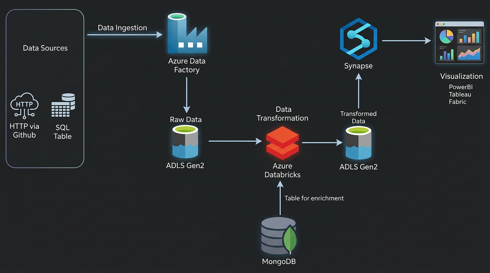

# 🛒 Olist E-Commerce Azure ETL Pipeline

## Overview
End-to-end ETL pipeline built on Microsoft Azure 
processing the Brazilian Olist E-Commerce dataset 
using Medallion Architecture (Bronze → Silver → Gold).

Data is ingested from multiple sources, transformed 
using PySpark, and served via Synapse Analytics 
for downstream consumption.

## Architecture

Bronze → Silver → Gold
ADF    → Databricks → Synapse

## Tech Stack
| Layer          | Tool                          |
|----------------|-------------------------------|
| Orchestration  | Azure Data Factory            |
| Storage        | Azure Data Lake Storage Gen2  |
| Transformation | Azure Databricks (PySpark)    |
| Serving        | Azure Synapse Analytics       |
| Source DB      | MySQL (filess.io)             |
| Auth           | App Registration + OAuth      |
| Format         | Parquet + Snappy Compression  |

## Pipeline Layers

### Bronze Layer (Raw Ingestion)
- ADF ingests 7 CSV files from GitHub via HTTP connector
- Dynamic pipeline using Lookup + ForEach pattern
- MySQL database ingested via ADF MySQL connector
- All raw files stored in ADLS Gen2 bronze container

### Silver Layer (Transformation)
- Databricks reads all 7 CSVs from bronze
- PySpark joins across customers, orders, 
  order_items, products, sellers, geolocation, reviews
- Duplicate column removal
- Written as Parquet to silver container

### Gold Layer (Serving)
- Synapse serverless SQL reads silver via OPENROWSET
- CETAS creates external table in gold container
- Queryable via gold.finaltable external table

## Key Highlights
- Dynamic ADF pipeline — no hardcoded file names
- Service Principal authentication (OAuth 2.0)
- Secrets managed via Databricks Secret Scope
- Medallion architecture for data quality layers
- Serverless SQL via Synapse OPENROWSET
- CETAS pattern for gold external tables

## Setup
1. Clone this repo
2. Create Azure resources (ADF, ADLS, Databricks, Synapse)
3. Configure App Registration and Secret Scope
4. Import ADF pipeline JSON
5. Run Databricks notebook
6. Execute Synapse SQL scripts

## Screenshots
### ADF Pipeline

### Databricks Transformation

### Synapse Gold Layer

